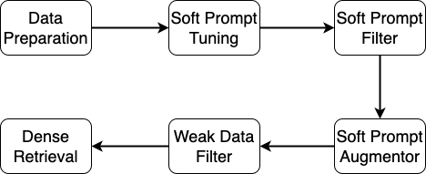

# SPTAR — Phase 2 GRPO Pipeline

**Soft Prompt Tuning for Augmenting Dense Retrieval with Large Language Models**  
This version covers the **Phase 2 GRPO soft-prompt improvement loop** only.  
ColBERT, BM25, and BM25CE are not included.

---

## What is SPTAR?

SPTAR is a pipeline that uses soft prompt tuning on an LLM (LLaMA-2-7B) to automatically generate weak document–query pairs, which are then used to train a dense retriever (DPR). The pipeline has two phases:

- **Phase 1** — Initial soft prompt training to generate a seed set of weak queries — see [Phase 1 repo](https://github.com/VishnuReddy25/sptar_v1_conference/tree/recall%40100-0.5825)
- **Phase 2 (this repo)** — GRPO reinforcement loop that improves the soft prompt using DPR-based reward signals, producing a larger and higher-quality query pool

---

## Repository Structure

```
.
├── xuyang/                         # Soft prompt tuning modules
│   ├── llm_models/                 # Phase 1 .npy soft-prompt weights
│   └── default_prompt.py           # Fixed few-shot prompt templates
├── zhiyuan/                        # DPR retriever modules
│   ├── datasets/raw/beir/          # BEIR datasets (fiqa, msmarco, etc.)
│   └── retriever/dpr/train/        # DPR training scripts
├── grpo_phase2_v2.py               # ← Main Phase 2 training script
├── output/grpo_phase2/             # Generated outputs (queries, adapters)
├── logs/                           # Auto-generated training logs
└── environment.yml                 # Conda environment spec
```

---

## Setup

### 1. Create the environment

```bash
conda env create -f environment.yml
conda activate sptar
```

If you see this error:
```
nvidia/cublas/lib/libcublas.so.11: symbol cublasLtGetStatusString ...
```
Run:
```bash
pip uninstall nvidia_cublas_cu11
```

If you see a `setuptools` / `packaging` import error:
```bash
pip install setuptools==69.5.1
```

### 2. Install modified packages

```bash
cd package/beir
pip install -e .

cd package/sentence-transformers
pip install -e .
```

---

## Data Preparation

Download BEIR datasets and generate the required corpus files:

```bash
python zhiyuan/download.py
python zhiyuan/data_process.py
```

This generates three files per dataset under `zhiyuan/datasets/raw/beir/<dataset>/`:

| File | Purpose |
|---|---|
| `corpus_filtered.jsonl` | All unlabelled documents |
| `corpus_5000_reduced_ratio_20.jsonl` | Small eval corpus (used when weak pairs ≤ 5k) |
| `corpus_100k_reduced_ratio_20.jsonl` | Larger eval corpus (used when weak pairs ≥ 100k) |

Alternatively, download our pre-processed datasets from Google Drive and place them under `zhiyuan/`.

---

## Phase 2 GRPO Training

### What it does

1. Loads the LLaMA-2-7B model with the Phase 1 soft-prompt weights
2. Each epoch: selects 300 informative docs using DPR embedding variance ranking
3. Generates a group of candidate queries per doc using the soft prompt
4. Scores queries with a composite reward (relevance + retrievability + specificity)
5. Updates the soft prompt via GRPO (clipped policy gradient + KL penalty)
6. Periodically retrains the DPR retriever on the accumulated query pool
7. Saves the best adapter based on NDCG@10 on a held-out eval set

### Run command

```bash
python grpo_phase2_v2.py \
    --peft_model_id   <path_to_phase1_peft_adapter> \
    --dpr_ckpt        <path_to_dpr_checkpoint> \
    --weak_queries    <path_to_phase1_weak_queries.jsonl> \
    --weak_qrels      <path_to_phase1_weak_train.tsv> \
    --corpus          zhiyuan/datasets/raw/beir/fiqa/corpus_filtered.jsonl \
    --eval_corpus     zhiyuan/datasets/raw/beir/fiqa/corpus_5000_reduced_ratio_20.jsonl \
    --dev_queries     zhiyuan/datasets/raw/beir/fiqa/dev_queries.jsonl \
    --dev_qrels       zhiyuan/datasets/raw/beir/fiqa/dev_qrels.tsv \
    --dataset_name    fiqa_50 \
    --phase1_npy      ./xuyang/llm_models/v1_fiqa_50_llama-7b_llama-7b_CAUSAL_LM_TEXT_50_50_3_2023-06-04_0 \
    --output_dir      output/grpo_phase2 \
    --grpo_group_size 6 \
    --max_new_tokens  40 \
    --lr              5e-3 \
    --kl_coeff        0.02 \
    --clip_ratio      0.2 \
    --temperature     0.5 \
    --grpo_epochs     2 \
    --docs_per_epoch  300 \
    --load_in_4bit
```

### Key arguments

| Argument | Default | Description |
|---|---|---|
| `--peft_model_id` | required | Path to Phase 1 PEFT adapter directory |
| `--dpr_ckpt` | required | Path to pre-trained DPR/SentenceTransformer checkpoint |
| `--phase1_npy` | see above | Path to Phase 1 `.npy` soft-prompt weights |
| `--dataset_name` | `fiqa_50` | One of `fiqa_50`, `ms_50`, `hotpotqa_50`, `fever_50` |
| `--docs_per_epoch` | `300` | Docs selected per epoch via DPR ranking |
| `--grpo_group_size` | `6` | Candidate queries generated per document |
| `--grpo_epochs` | `2` | Number of training epochs |
| `--kl_coeff` | `0.02` | KL penalty weight (auto-adjusted during training) |
| `--dpr_retrain_every` | `200` | Retrain DPR every N processed docs |
| `--load_in_4bit` | True | Load LLM in 4-bit NF4 (saves ~14GB VRAM) |

---

## Outputs

After training, `output/grpo_phase2/` contains:

| File / Folder | Description |
|---|---|
| `best_peft_adapter/` | Adapter checkpoint with best NDCG@10 |
| `final_peft_adapter/` | Adapter at end of training |
| `peft_epoch{N}/` | Adapter saved after each epoch |
| `final_weak_queries.jsonl` | Full accumulated query pool |
| `final_weak_train.tsv` | Full accumulated qrels |
| `queries_step{N}.jsonl` | Query pool snapshot at step N |
| `summary.json` | Best NDCG@10, history, pool size |
| `logs/grpo_phase2_*.log` | Full training log |

---

## Final DPR Training

After Phase 2 completes, train the final DPR retriever on the full query pool:

```bash
python zhiyuan/dpr_eval.py \
    --dataset_name fiqa \
    --version v1 \
    --gpu_id 0 \
    --train_num 50 \
    --weak_num <total_queries_in_pool> \
    --exp_names grpo_phase2
```

The exact command is also printed at the end of every training run.

---

## Query & Document Filtering (Phase 2 v2)

The pipeline applies strict filters to ensure only clean, meaningful data enters training:

**Document filters** — skip docs with fewer than 50 words or less than 50% alphabetic tokens

**Query filters (post-generation)** — reject queries that:
- Contain any digit
- Are shorter than 4 words or longer than 20 words
- Have more than 10% non-alphabetic characters

**Reward filters** — skip the entire document if all generated queries score zero reward

**Reward components:**

| Component | Weight | Description |
|---|---|---|
| Relevance | 0.4 | Token overlap between query and document |
| Retrievability | 0.4 | Reciprocal rank of the source doc when retrieved by the query |
| Specificity | 0.2 | Query length, structure, and vocabulary diversity |

---

## Citing

If you find SPTAR helpful, please cite:

```bibtex
@article{DBLP:journals/kbs/PengWWF25,
  author  = {Zhiyuan Peng and Xuyang Wu and Qifan Wang and Yi Fang},
  title   = {Soft prompt tuning for augmenting dense retrieval with large language models},
  journal = {Knowl. Based Syst.},
  volume  = {309},
  pages   = {112758},
  year    = {2025},
  doi     = {10.1016/J.KNOSYS.2024.112758}
}
```


<div align="center">

# [SPTAR](https://arxiv.org/abs/2307.08303)

</div>

# What is it?
SPTAR represents `Soft Prompt Tuning for Augmenting Dense Retrieval with Large Language Models` which consists of six modules as shown in the following image:

<div align="center">

</div>

This repo consists of two floders `xuyang` and `zhiyuan` where `xuyang` contains the soft prompt tuning, soft prompt filter and soft prompt augmentor modules. `zhiyuan` contains weak data filter and dense retrieval modules. Check `xuyang`'s readme file for generating uncleaned weak document-query pairs. Follow this readme file to reproduce the results.

# Reproduce Results

## Setup py37 Env
`py37` env is for DPR, BM25CE and generating the data for ColBERT:
```
python zhiyuan/retriever/dpr/train/gen_data_for_colbert.py
```
Create `py37` env by:
```
conda env create -f environment.yml
```
If you find this error:
```
nvidia/cublas/lib/libcublas.so.11: symbol cublasLtGetStatusString version libcublasLt.so.11 not defined in file libcublasLt.so.11 with link time reference
```
Then, run the following command in your `py37` env:
```
pip uninstall nvidia_cublas_cu11
```
If you find this error:
```
Traceback (most recent call last):
  File "<stdin>", line 1, in <module>
  File "/opt/conda/envs/tasb/lib/python3.8/site-packages/torch/utils/cpp_extension.py", line 25, in <module>
    from pkg_resources import packaging  # type: ignore[attr-defined]
ImportError: cannot import name 'packaging' from 'pkg_resources' (/opt/conda/envs/tasb/lib/python3.8/site-packages/pkg_resources/__init__.py)
```
Then, downgrad your `setuptools` to `setuptools=69.5.1` in your env.
We modified package beirV1.0.1 and sentence-transformersV2.2.2, so, after setting up the `py37` env, install the two package locally:
```
cd package/beir
pip install -e .
cd package/sentence-transformers
pip install -e .
```

## Setup col37bert Env
col37bert env is for ColBERT. Create col37bert env by:
```
conda env create -f zhiyuan/retriever/col_bert/col37bert.yml
```
## Data Preparation
To make sure you have the exact same data as ours, we recommand you download our `datasets` from [Google Drive](https://drive.google.com/drive/folders/1wjwevAAORCf_vunP0OsoArfdwpP25QuO?usp=sharing) and place `datasets` under path `zhiyuan/`. Or you can download the BEIR dataset and generate the necessary files by the commands below:

```
python zhiyuan/download.py
python zhiyuan/data_process.py 
```

`zhiyuan/data_process.py` is to generate three jsonl files for each dataset:
1. zhiyuan/datasets/raw/beir/fiqa or msmarco/corpus_filtered.jsonl
2. zhiyuan/datasets/raw/beir/fiqa or msmarco/corpus_5000_reduced_ratio_20.jsonl
3. zhiyuan/datasets/raw/beir/fiqa or msmarco/corpus_100k_reduced_ratio_20.jsonl

`corpus_filtered.jsonl` stores all the unlabled documents. `corpus_5000_reduced_ratio_20.jsonl` stores the sampled small corpus for fast evaluation during DPR training when # of weak paris is 5000. Similarly, corpus_100k_reduced_ratio_20.jsonl is for fast evaluation during DPR training when # of weak paris is 100k. For ColBERT, we run the official ColBERT code and there is no evaluation after each epoch. We directly run ColBERT 20 epoches and test checkpoints (3, 5, 10, 15, 18, 20) on test dataset and report the best results. So, for ColBERT, there is no need for these sampled corpus.

## Commands

### BM25
```
# fiqa
docker pull beir/pyserini-fastapi
docker run -p 8002:8000 -it --name fiqa --rm beir/pyserini-fastapi:latest
python zhiyuan/retriever/bm25anserini/evaluate_anserini_bm25.py --dataset_name fiqa

# msmarco
docker pull beir/pyserini-fastapi 
docker run -p 8000:8000 -it --name msmarco --rm beir/pyserini-fastapi:latest
python zhiyuan/retriever/bm25anserini/evaluate_anserini_bm25.py --dataset_name msmarco
```

### W/O

#### DPR
```
# fiqa
python zhiyuan/dpr_eval.py --dataset_name fiqa --version v1 --gpu_id 0 --train_num 50 -exps no_aug --weak_num 100k

# msmarco
python zhiyuan/dpr_eval.py --dataset_name msmarco --version v1 --gpu_id 0 --train_num 50 -exps no_aug --weak_num 100k
```
Testing results are logged in `zhiyuan/retriever/dpr/train/output/no_aug/`
#### ColBERT
```
# fiqa
## gen ColBERT data (You need to run this command in py37 env)
python zhiyuan/retriever/dpr/train/gen_data_for_colbert.py --dataset_name fiqa --exp_name no_aug
## train
bash zhiyuan/retriever/col_bert/train_colbert.sh -g 0,1,2,3 -d fiqa -e no_aug -m 80 -s 4 -b 128
## test
bash zhiyuan/retriever/col_bert/test_colbert.sh -g 0,1,2,3 -d fiqa -e no_aug -p 96 -c 80

# msmarco
## gen ColBERT data (You need to run this command in py37 env)
python zhiyuan/retriever/dpr/train/gen_data_for_colbert.py --dataset_name msmarco --exp_name no_aug
## train
bash zhiyuan/retriever/col_bert/train_colbert.sh -g 0,1,2,3 -d msmarco -e no_aug -m 40 -s 2 -b 128
## test
bash zhiyuan/retriever/col_bert/test_colbert.sh -g 0,1,2,3 -d msmarco -e no_aug -p 2000 -c 40
```
Testing results of ColBERT are documented in `$LOG_DIR/test_log.txt` where `LOG_DIR` is defined in `zhiyuan/retriever/col_bert/test_colbert.sh`
#### BM25CE
```
# fiqa
docker pull beir/pyserini-fastapi 
docker run -p 8002:8000 -it --name fiqa --rm beir/pyserini-fastapi:latest
python zhiyuan/retriever/bm25ce/eval/evaluate_bm25_ce_dpr.py --dataset_name fiqa --exp_name no_aug --topk 1000

# msmarco
docker pull beir/pyserini-fastapi 
docker run -p 8000:8000 -it --name msmarco --rm beir/pyserini-fastapi:latest
python zhiyuan/retriever/bm25ce/eval/evaluate_bm25_ce_dpr.py --dataset_name msmarco --exp_name no_aug --topk 1000
```
Testing results are logged in `zhiyuan/retriever/bm25ce/eval/output/no_aug`

### InPars

#### DPR
```
# fiqa
python zhiyuan/dpr_eval.py --dataset_name fiqa --version v1 --gpu_id 0 --train_num 50 -exps p_written_100k_vicuna_prompt_2_filtered_70 --weak_num 100k

# msmarco
python zhiyuan/dpr_eval.py --dataset_name msmarco --version v1 --gpu_id 0 --train_num 50 -exps p_written_100k_vicuna_prompt_3_filtered_30 --weak_num 100k
```
#### ColBERT
```
# fiqa
## gen ColBERT training data by load the same training data as DPR. Because, ColBERT using training triples, for each query, sample 2 times negative documents as that of positive documents. (You need to run this command in py37 env). For test queirs and corpus, run the first data_process.py run by test_colbert.sh generates the testing queries and corpus by call beir dataloader.
python zhiyuan/retriever/dpr/train/gen_data_for_colbert.py --dataset_name fiqa --exp_name p_written_100k_vicuna_prompt_2_filtered_70 (weak_num=100k by default)
## train
bash zhiyuan/retriever/col_bert/train_colbert.sh -g 0,1,2,3 -d fiqa -e p_written_100k_vicuna_prompt_2_filtered_70 -m 1200 -s 60 -b 128
## test
bash zhiyuan/retriever/col_bert/test_colbert.sh -g 0,1,2,3 -d fiqa -e p_written_100k_vicuna_prompt_2_filtered_70 -p 96 -c 120

# msmarco
## gen ColBERT data (You need to run this command in py37 env)
python zhiyuan/retriever/dpr/train/gen_data_for_colbert.py --dataset_name msmarco --exp_name p_written_100k_vicuna_prompt_3_filtered_30
## train
bash zhiyuan/retriever/col_bert/train_colbert.sh -g 0,1,2,3 -d msmarco -e p_written_100k_vicuna_prompt_3_filtered_30 -m 6300 -s 315 -b 128
## test
bash zhiyuan/retriever/col_bert/test_colbert.sh -g 0,1,2,3 -d msmarco -e p_written_100k_vicuna_prompt_3_filtered_30 -p 2000 -c 6300
```
#### BM25CE
```
# fiqa
docker pull beir/pyserini-fastapi 
docker run -p 8002:8000 -it --name fiqa --rm beir/pyserini-fastapi:latest
python zhiyuan/retriever/bm25ce/eval/evaluate_bm25_ce_dpr.py --dataset_name fiqa --exp_name p_written_100k_vicuna_prompt_2_filtered_70 --topk 1000

# msmarco
docker pull beir/pyserini-fastapi 
docker run -p 8000:8000 -it --name msmarco --rm beir/pyserini-fastapi:latest
python zhiyuan/retriever/bm25ce/eval/evaluate_bm25_ce_dpr.py --dataset_name msmarco --exp_name p_written_100k_vicuna_prompt_3_filtered_30 --topk 1000
```

### SPTAR

#### DPR
```
# fiqa
python zhiyuan/dpr_eval.py --dataset_name fiqa --version v1 --gpu_id 0 --train_num 50 -exps llama_7b_100k_fixed_v3_best_llama_prompt_2_filtered_70 --weak_num 100k

# msmarco
python zhiyuan/dpr_eval.py --dataset_name msmarco --version v1 --gpu_id 0 --train_num 50 -exps llama_7b_100k_fixed_v4_best_llama_prompt_3_filtered_30 --weak_num 100k
```
#### ColBERT
```
# fiqa
## gen ColBERT data (You need to run this command in py37 env)
python zhiyuan/retriever/dpr/train/gen_data_for_colbert.py --dataset_name fiqa --exp_name llama_7b_100k_fixed_v3_best_llama_prompt_2_filtered_70
## train
bash zhiyuan/retriever/col_bert/train_colbert.sh -g 0,1,2,3 -d fiqa -e llama_7b_100k_fixed_v3_best_llama_prompt_2_filtered_70 -m 3900 -s 195 -b 128
## test
bash zhiyuan/retriever/col_bert/test_colbert.sh -g 0,1,2,3 -d fiqa -e llama_7b_100k_fixed_v3_best_llama_prompt_2_filtered_70 -p 96 -c 975

# msmarco
## gen ColBERT data (You need to run this command in py37 env)
python zhiyuan/retriever/dpr/train/gen_data_for_colbert.py --dataset_name msmarco --exp_name llama_7b_100k_fixed_v4_best_llama_prompt_3_filtered_30
## train
bash zhiyuan/retriever/col_bert/train_colbert.sh -g 0,1,2,3 -d msmarco -e llama_7b_100k_fixed_v4_best_llama_prompt_3_filtered_30 -m 6460 -s 323 -b 128
## test
bash zhiyuan/retriever/col_bert/test_colbert.sh -g 0,1,2,3 -d msmarco -e llama_7b_100k_fixed_v4_best_llama_prompt_3_filtered_30 -p 2000 -c 6460
```
#### BM25CE
```
# fiqa
docker pull beir/pyserini-fastapi 
docker run -p 8002:8000 -it --name fiqa --rm beir/pyserini-fastapi:latest
python zhiyuan/retriever/bm25ce/eval/evaluate_bm25_ce_dpr.py --dataset_name fiqa --exp_name llama_7b_100k_fixed_v3_best_llama_prompt_2_filtered_70 --topk 1000

# msmarco
docker pull beir/pyserini-fastapi 
docker run -p 8000:8000 -it --name msmarco --rm beir/pyserini-fastapi:latest
python zhiyuan/retriever/bm25ce/eval/evaluate_bm25_ce_dpr.py --dataset_name msmarco --exp_name llama_7b_100k_fixed_v4_best_llama_prompt_3_filtered_30 --topk 1000
```
## Weak Data Filter Module
llama_7b_100k_fixed_v4_best_llama_prompt_3_filtered_30 comes from filtering llama_7b_100k_fixed_v4_best_llama_prompt_3 by `zhiyuan/filter/bm25anserini_split.py` with `topk=30` where llama_7b_100k_fixed_v4_best_llama_prompt_3 contains raw 100k weak document-query pairs generated by soft prompt augmentor module. 
## Official Code
BM25, DPR and ColBERT utilized in this repo are based on their offical implementations:
### [BM25](https://github.com/beir-cellar/beir/blob/main/examples/retrieval/evaluation/lexical/evaluate_anserini_bm25.py)
### [DPR](https://github.com/beir-cellar/beir/blob/main/examples/retrieval/training/train_sbert.py)
### [ColBERT](https://github.com/thakur-nandan/beir-ColBERT)
# Citing
If you find our SPTAR helpful, please cite our paper [Soft Prompt Tuning for Augmenting Dense Retrieval with Large Language Models](https://arxiv.org/abs/2307.08303):
```
@article{DBLP:journals/kbs/PengWWF25,
  author       = {Zhiyuan Peng and
                  Xuyang Wu and
                  Qifan Wang and
                  Yi Fang},
  title        = {Soft prompt tuning for augmenting dense retrieval with large language
                  models},
  journal      = {Knowl. Based Syst.},
  volume       = {309},
  pages        = {112758},
  year         = {2025},
  url          = {https://doi.org/10.1016/j.knosys.2024.112758},
  doi          = {10.1016/J.KNOSYS.2024.112758},
  timestamp    = {Wed, 08 Jan 2025 21:12:31 +0100},
  biburl       = {https://dblp.org/rec/journals/kbs/PengWWF25.bib},
  bibsource    = {dblp computer science bibliography, https://dblp.org}
}
```
# sptar-r-e
# sptar_v1
